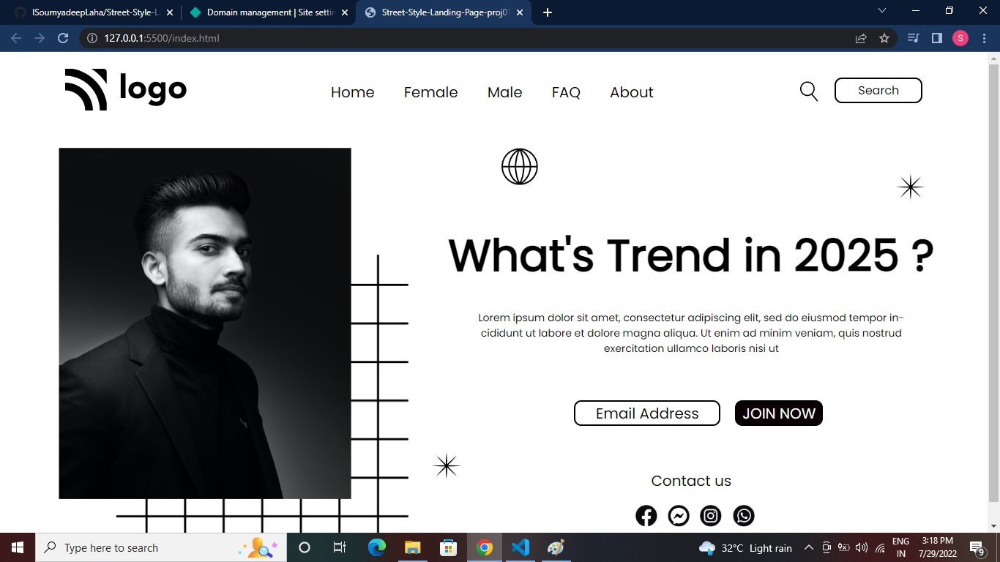

# Street Style Landing Page (Project 01)

by Soumyadeep Laha

## Learning from this project

I have started my JavaScript Bootcamp with this project, started the journey of learning with first phase i.e., HTML and CSS. So with this project I have learned:

- About the CSS position Property.
- Learned the behind the seens senario of using different position values, as relative and absolute.
- Learned about the different types of Selectors
- Also I have used CSS flexbox.

## Time taken to complete this project

It tooked me about 2 hours. After doing many research on CSS position property.

## Screen Shorts of the project

## Live link to the project

[Netlify Link...](https://street-style-landing-page-proj01.netlify.app/)